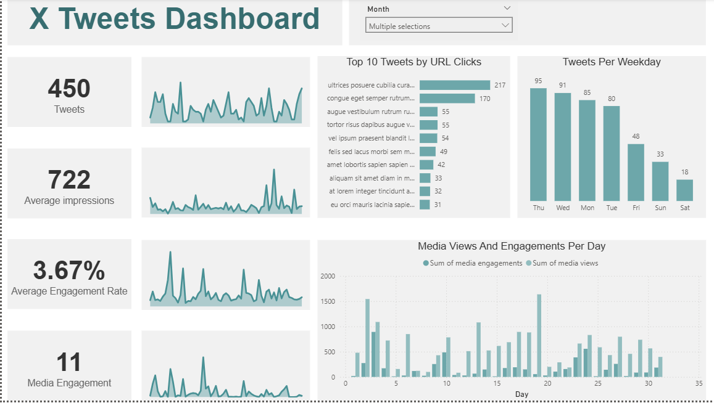

# X Tweets Dashboard

This is a Power BI dashboard project that analyzes Twitter (X) performance data. The dashboard visualizes tweet activity, engagement rates, impressions, and URL clicks helping understand social media performance by day, weekday, and top tweets.

## Features

- *Count of Tweets by Date*
- *Average Impressions by Date*
- *Engagement Rate (%)*
- *Media Engagement Trends*
- *Top 10 Tweets by URL Clicks*
- *Tweets Distribution by Weekday*
- *Daily Media Views and Engagements*

## Tools Used

- *Power BI*
- *Power Query* for data cleaning
- *DAX* for column creation (Weekday = FORMAT(SocialMedia[Date], "ddd"))

> *Note*: No DAX measures were used in this version.

## Data Preparation

- Data cleaning and transformation were done using *Power Query* in Power BI.
- A calculated column was added to extract the weekday from the date.
- Visuals were created based on cleaned and filtered data.

## How to View

To open and interact with the dashboard:

1. Clone this repository or download the .pbix file.
2. Open the file using *Power BI Desktop*.
3. Make sure your data source is accessible or refresh your data as needed.

## Preview

> *Note*: This project is for educational and analytical purposes. Feel free to fork or build upon it with credit.
